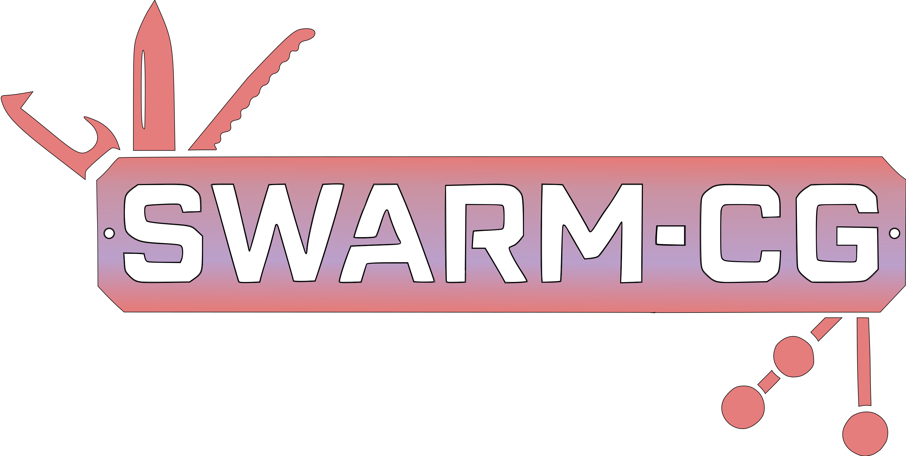

# SWARM-CG: Swiss Army Knife of Call Graph Micro-Benchmark

<p align="center">

</p>

SWARM-CG (Swiss Army Knife of Call Graph Micro-Benchmark) aims to standardize the evaluation of call graph analysis tools by providing a rich set of call graph benchmarks. This repository contains code samples and associated ground truth across multiple languages, facilitating cross-language performance comparisons and discussions.

## Features

- **Multi-language support**: Benchmarks in various programming languages.
- **Ground truth annotations**: Accurate call-graph information for each sample.
- **Tool evaluation**: Framework for assessing static analysis tools.
- **Community-driven**: Contributions from static analysis enthusiasts and experts.

## Languages Supported

Our repository includes benchmarks for the following languages:

- Java
- Python
- JavaScript

*More languages will be added soon.*


## :whale: Running with Docker

### 1️⃣ Clone the repo

```bash
git clone https://github.com/ashwinprasadme/SWARM-CG/
```

### 2️⃣ Build Docker image

```bash
docker build -t swarmcg .
```

### 3️⃣ Run SWARM-CG

🕒 Takes about 30mins on first run to build Docker containers.

📂 Results will be generated in the `results` folder within the root directory of the repository.
Each results folder will have a timestamp, allowing you to easily track and compare different runs.

🔧 run analysis on specific tools:

```bash
docker run \
      -v /var/run/docker.sock:/var/run/docker.sock \
      -v ./results:/app/results \
      -v ./src:/app/src \
      swarmcg --language python --benchmark_name pycg --tool llms 
```

🛠️ Available options: `pycg`, `ollama`, `llms`
