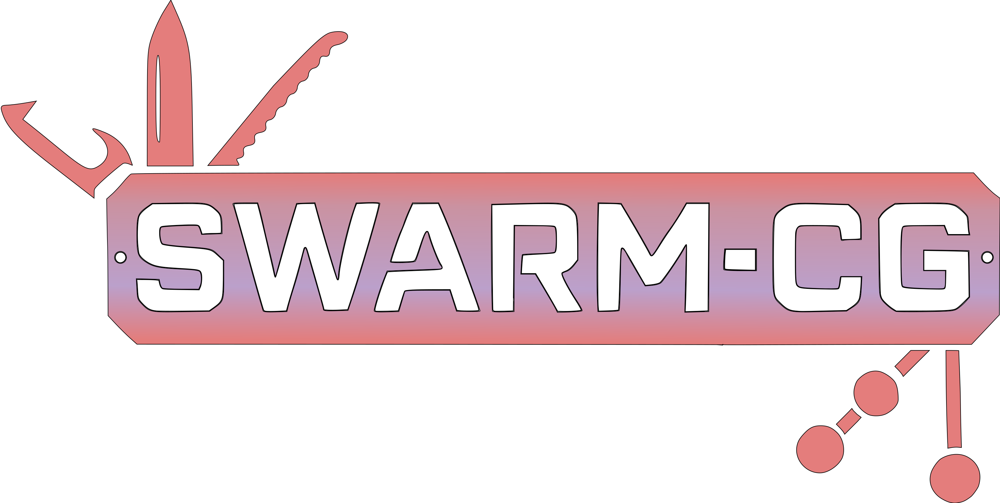

# SWARM-CG: Swiss Army Knife of Call Graph Micro-Benchmark

<p align="center">

</p>

SWARM-CG (Swiss Army Knife of Call Graph Micro-Benchmark) aims to standardize the evaluation of call graph analysis tools by providing a rich set of call graph benchmarks. This repository contains code samples and associated ground truth across multiple languages, facilitating cross-language performance comparisons and discussions.

## Features

- **Multi-language support**: Benchmarks in various programming languages.
- **Ground truth annotations**: Accurate call-graph information for each sample.
- **Tool evaluation**: Framework for assessing static analysis tools.
- **Community-driven**: Contributions from static analysis enthusiasts and experts.

## Languages Supported

Our repository includes benchmarks for the following languages:

- Java
- Python
- JavaScript

*More languages will be added soon.*


## :whale: Running with Docker

### 1️⃣ Clone the repo

```bash
git clone https://github.com/ashwinprasadme/SWARM-CG/
```

### 2️⃣ Build Docker image

```bash
docker build -t swarmcg .
```

### 3️⃣ Run SWARM-CG

🕒 Takes about 30mins on first run to build Docker containers.

📂 Results will be generated in the `results` folder within the root directory of the repository.
Each results folder will have a timestamp, allowing you to easily track and compare different runs.

🔧 run analysis on specific tools:

```bash
docker run \
      -v /var/run/docker.sock:/var/run/docker.sock \
      -v ./results:/app/results \
      -v ./src:/app/src \
      swarmcg --language python --benchmark_name pycg --tool llms 
```

🛠️ Available options: `pycg`, `ollama`, `llms`, `agentic_cg`

---

## 🤖 Agentic CG Tool

`agentic_cg` is an LLM-based call graph construction tool that uses an agentic tool-calling loop (via [LiteLLM](https://github.com/BerriAI/litellm)) to iteratively read source files, extract call sites, and produce a call graph. It supports any LLM provider accessible through LiteLLM.

### Running via the SWARM-CG pipeline (Docker)

Set your model and API key in `src/config.yaml` under the `agentic_cg` section:

```yaml
agentic_cg:
  model: "gpt-4o-mini"       # LiteLLM model string
  api_key: "<YOUR_API_KEY>"
  api_base: "null"           # leave as "null" for cloud providers
  max_iterations: 10
  temperature: 0.1
```

Then run the full pipeline (builds the Docker image, runs inference, analyzes results):

```bash
docker run \
      -v /var/run/docker.sock:/var/run/docker.sock \
      -v ./results:/app/results \
      -v ./src:/app/src \
      swarmcg --language python --benchmark_name pycg --tool agentic_cg
```

For a custom OpenAI-compatible server (vLLM, LM Studio, llama.cpp, etc.):

```yaml
agentic_cg:
  model: "openai/Qwen/Qwen3-30B-A3B-Instruct"
  api_key: "token-abc123"
  api_base: "http://your-server:8000/v1"
  max_iterations: 10
  temperature: 0.1
```

For Ollama running locally on the host:

```yaml
agentic_cg:
  model: "ollama/llama3.1"
  api_key: ""
  api_base: "http://host.docker.internal:11434"
  max_iterations: 10
  temperature: 0.1
```

> **Note:** When using Ollama from inside a Docker container, use `host.docker.internal` instead of `localhost` to reach the host machine.

### Running directly (no Docker, for development)

Install dependencies and run the runner script directly against a benchmark directory:

```bash
cd src/target_tools/agentic_cg/src
pip install -r ../requirements.txt

# Set the sandbox path so the tool can read benchmark files
export SWARM_CG_BENCHMARK_PATH=/path/to/benchmarks/python/pycg

# OpenAI
export OPENAI_API_KEY=sk-...
python runner.py \
    --benchmark_path /path/to/benchmarks/python/pycg/direct_calls/assigned_call \
    --model gpt-4o-mini \
    --max_iterations 10

# Custom OpenAI-compatible server
export OPENAI_API_KEY=token-abc123
export OPENAI_BASE_URL=http://your-server:8000/v1
python runner.py \
    --benchmark_path /path/to/benchmarks/python/pycg/direct_calls/assigned_call \
    --model openai/your-model-name \
    --max_iterations 10

# Ollama (local)
python runner.py \
    --benchmark_path /path/to/benchmarks/python/pycg/direct_calls/assigned_call \
    --model ollama/llama3.1 \
    --api_base http://localhost:11434 \
    --max_iterations 10
```

Each test case directory will receive a `main_result.json` (the call graph output) and a `main_trajectory.md` (human-readable agent trace for debugging).

### Output format

`main_result.json` follows the same format as the ground truth `callgraph.json`:

```json
{
    "main": ["main.func"],
    "main.func": ["main.helper", "<builtin>.print"],
    "main.helper": []
}
```
